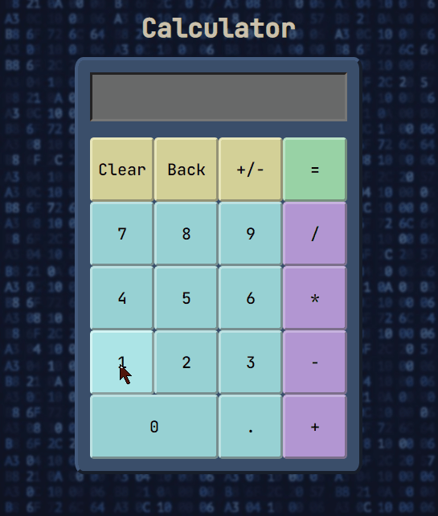

# calculator
<h2 align="center"><a target="_blank" href="https://aurelien-genois.github.io/calculator/">Live Demo</a></h2>

## Description
The [fourth Odin project](https://www.theodinproject.com/paths/foundations/courses/foundations/lessons/calculator) is a classic calculator for practice basic JavaScript (functions, arrays, strings, Loops, code organization...). 

## Features

- Can add/substract/divide/multiply several numbers in a row
- Can change the current number sign
- Can add (only one) dot per number
- Can delete a number or an operator
- Can clear the display

- The prec operation is displayed above the result
- The design is very simple, just different colors for inputs to differentiate numbers, operators and functions inputs

## Challenges
Resolving problem thinking (in particular with pseudo code) was one goal of this project.

The real challenge was combining conditionnals, loops, and number/strings/arrays manipulations to manage operations and to display numbers and operators. 

For example, thinking how to manage priority operations for multiplications and divisions, before additions and substractions, with loops and conditionnals was very instructing for manipulating arrays.
